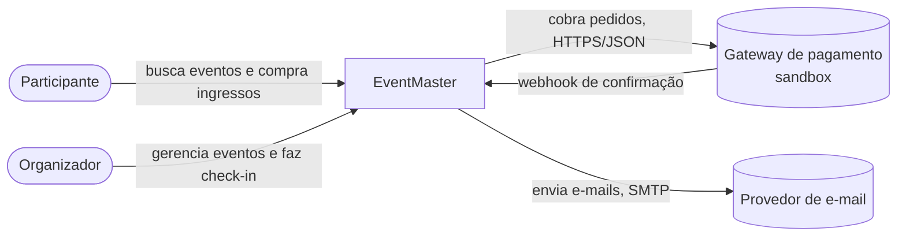
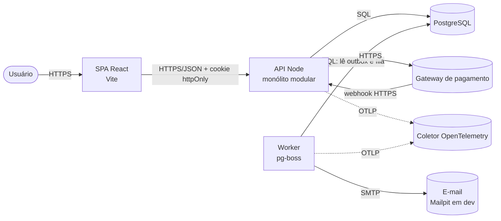
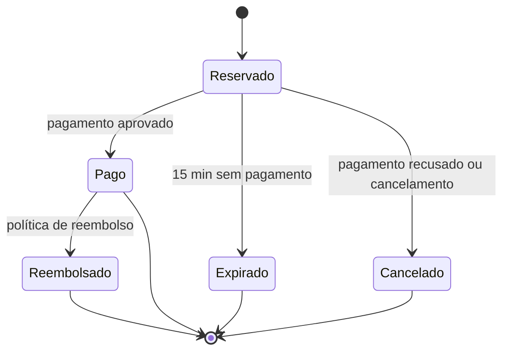

# Diagramas C4

Usam `flowchart` do Mermaid com a notação do C4 (a sintaxe nativa `C4Context` do Mermaid é experimental).

## Nível 1: Contexto

```mermaid
flowchart LR
  P([Participante]) -->|busca eventos e compra ingressos| EM[EventMaster]
  O([Organizador]) -->|gerencia eventos e faz check-in| EM
  EM -->|cobra pedidos, HTTPS/JSON| PG[(Gateway de pagamento\nsandbox)]
  PG -->|webhook de confirmação| EM
  EM -->|envia e-mails, SMTP| MAIL[(Provedor de e-mail)]
```

## Nível 2: Contêineres

```mermaid
flowchart LR
  U([Usuário]) -->|HTTPS| WEB[SPA React\nVite]
  WEB -->|HTTPS/JSON + cookie httpOnly| API[API Node\nmonólito modular]
  API -->|SQL| DB[(PostgreSQL)]
  WORKER[Worker\npg-boss] -->|SQL: lê outbox e fila| DB
  WORKER -->|SMTP| MAIL[(E-mail\nMailpit em dev)]
  API -->|HTTPS| PG[(Gateway de pagamento)]
  PG -->|webhook HTTPS| API
  API -. OTLP .-> OBS[(Coletor OpenTelemetry)]
  WORKER -. OTLP .-> OBS
```

## Estados do pedido

```mermaid
stateDiagram-v2
  [*] --> Reservado
  Reservado --> Pago: pagamento aprovado
  Reservado --> Expirado: 15 min sem pagamento
  Reservado --> Cancelado: pagamento recusado ou cancelamento
  Pago --> Reembolsado: política de reembolso
  Pago --> [*]
  Expirado --> [*]
  Cancelado --> [*]
  Reembolsado --> [*]
```
